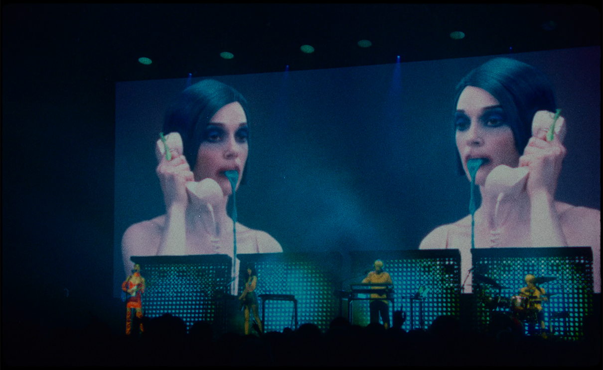

# h1 Heading
## h2 Heading
### h3 Heading
#### h4 Heading
##### h5 Heading
###### h6 Heading


### Horizontal Rules

___


### Emphasis

**This is bold text**

__This is bold text__

*This is italic text*

_This is italic text_

~~Strikethrough~~


### Blockquotes


> Blockquotes can also be nested...
>> ...by using additional greater-than signs right next to each other...
> > > ...or with spaces between arrows.


### Lists

Unordered

+ Create a list by starting a line with `+`, `-`, or `*`
+ Sub-lists are made by indenting 2 spaces:
  - Marker character change forces new list start:
    * Ac tristique libero volutpat at
    + Facilisis in pretium nisl aliquet
    - Nulla volutpat aliquam velit
+ Very easy!

Ordered

1. Lorem ipsum dolor sit amet
2. Consectetur adipiscing elit
3. Integer molestie lorem at massa


1. You can use sequential numbers...
1. ...or keep all the numbers as `1.`


#### Code

Inline `code`

Indented code

    // Some comments
    line 1 of code
    line 2 of code
    line 3 of code


Block code "fences"

```
Sample text here...
```

Syntax highlighting


### Tables

Left aligned columns

| Option | Description |
| :------ | :----------- |
| data   | path to data files to supply the data that will be passed into templates. |
| engine | engine to be used for processing templates. Handlebars is the default. |
| ext    | extension to be used for dest files. |

Centered aligned columns

| Option | Description |
| ------| -----------|
| data   | path to data files to supply the data that will be passed into templates. |
| engine | engine to be used for processing templates. Handlebars is the default. |
| ext    | extension to be used for dest files. |


### Links

[link text](http://dev.nodeca.com)

[link with title](http://nodeca.github.io/pica/demo/ "title text!")


### Images


<p aria-label="photo description" class='photo-desccription-as-p' >Armand Cabrera, 2010</p>


Mattis ullamcorper velit sed ullamcorper morbi tincidunt. Tortor posuere ac ut consequat semper viverra. Tellus mauris a diam maecenas sed enim ut sem viverra. Venenatis urna cursus eget nunc scelerisque viverra mauris in. Arcu ac tortor dignissim convallis aenean et tortor at. Curabitur gravida arcu ac tortor dignissim convallis aenean et tortor. Egestas tellus rutrum tellus pellentesque eu. Fusce ut placerat orci nulla pellentesque dignissim enim sit amet. Ut enim blandit volutpat maecenas volutpat blandit aliquam etiam. Id donec ultrices tincidunt arcu. Id cursus metus aliquam eleifend mi.

<figure class='larger-image'>

<figcaption>untitled, Aran Draco, source:  https://www.randomxu3z57b2.com/</figcaption>
</figure>

Lorem ipsum dolor sit amet, consectetur adipiscing elit, sed do eiusmod tempor incididunt ut labore et dolore magna aliqua. Vitae ultricies leo integer malesuada nunc vel risus commodo viverra. Adipiscing enim eu turpis egestas pretium. Euismod elementum nisi quis eleifend quam adipiscing. In hac habitasse platea dictumst vestibulum. Sagittis purus sit amet volutpat[^3]. Netus et malesuada fames ac turpis egestas. Eget magna fermentum iaculis eu non diam phasellus vestibulum lorem. Varius sit amet mattis vulputate enim. Habitasse platea dictumst quisque sagittis. Integer quis auctor elit sed vulputate mi. Dictumst quisque sagittis purus sit amet.

Mattis ullamcorper velit sed ullamcorper morbi tincidunt. Tortor posuere ac ut consequat semper viverra. Tellus mauris a diam maecenas sed enim ut sem viverra[^4]. Venenatis urna cursus eget nunc scelerisque viverra mauris in. Arcu ac tortor dignissim convallis aenean et tortor at. Curabitur gravida arcu ac tortor dignissim convallis aenean et tortor. Egestas tellus rutrum tellus pellentesque eu. Fusce ut placerat orci nulla pellentesque dignissim enim sit amet. Ut enim blandit volutpat maecenas volutpat blandit aliquam etiam. Id donec ultrices tincidunt arcu. Id cursus metus aliquam eleifend mi.

<figure>

<figcaption>untitled, Aran Draco, source:  https://www.randomxu3z57b2.com/</figcaption>
</figure>


#### Subscript

- 19<sup>th</sup>
- H<sup>2</sup>O


#### [Footnotes](https://github.com/markdown-it/markdown-it-footnote)

Footnote 1 link[^1].

Footnote 2 link[^2].


[^1]: Footnote **can have markup**

    and multiple paragraphs.

[^2]: In the evolving tapestry of our world, the effects and spatial consequences of change unveil a profound dance between human influence and the interconnectedness of existence..

[^3]: Footnote text [link to source](https://github.com/markdown-it/markdown-it-footnote).


[^4]: A route pattern was matched, *but no matching static path was found* for requested path `/blog/2/original_71c5fdbeb50571b57016161072b36a3a.jpg